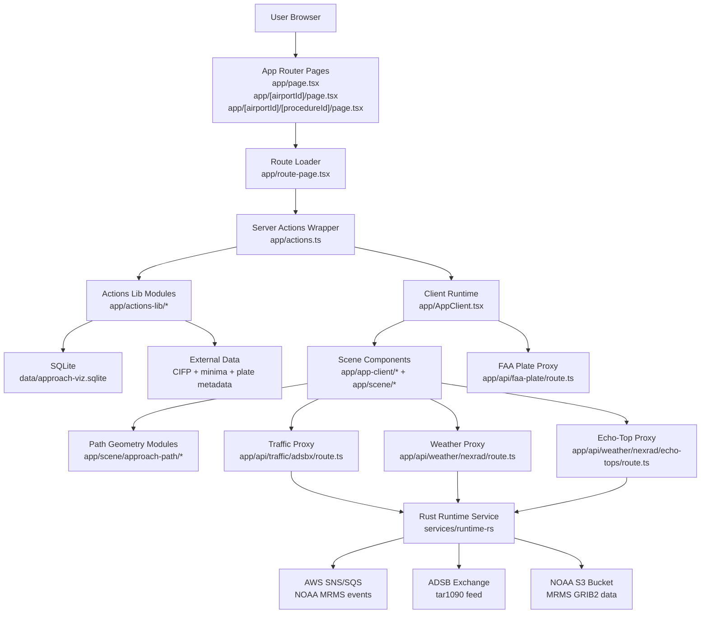

# Architecture Overview

This project uses a server-first data-loading model with a client-side 3D scene runtime and an external Rust runtime service for weather and traffic APIs.

## High-Level Flow

## Architecture Docs

- [`docs/architecture-data-and-actions.md`](architecture-data-and-actions.md): server data model, action layering, matching/enrichment, proxies, CI/instrumentation.
- [`docs/architecture-client-and-scene.md`](architecture-client-and-scene.md): client state orchestration, UI section boundaries, scene composition.
- [`docs/mrms-rust-pipeline.md`](mrms-rust-pipeline.md): Rust runtime service design, wire format, deployment, endpoints.
- [`docs/mrms-phase-methodology.md`](mrms-phase-methodology.md): thermodynamic-first phase resolver, dual-pol correction, debug telemetry.
