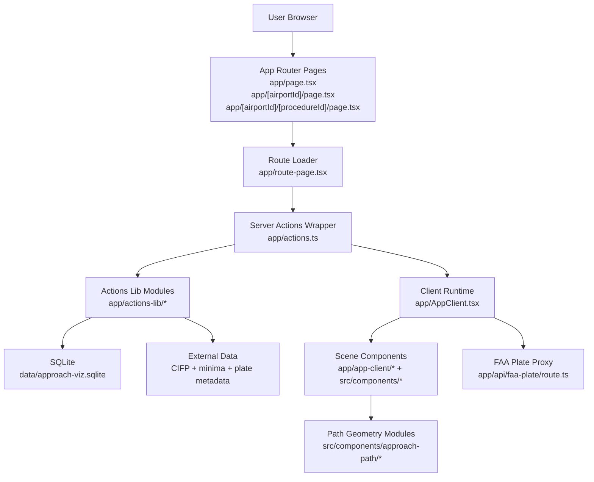

# Architecture Overview

This project uses a server-first data-loading model with a client-side 3D scene runtime.

## High-Level Flow

## Architecture Docs

- `docs/architecture-data-and-actions.md`: server data model, action layering, and matching/enrichment behavior.
- `docs/architecture-client-and-scene.md`: client state orchestration, UI section boundaries, and scene composition responsibilities.
