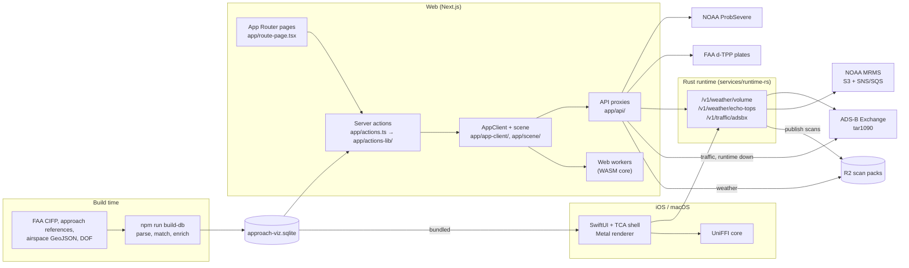

# Architecture Overview

ApproachViz has three moving parts:

- **Build-time data pipeline.** `npm run prepare-data` downloads FAA and airspace sources and compiles them into `data/approach-viz.sqlite`. Approach-reference matching and enrichment happen here, once.
- **Clients.** The Next.js web app reads that database on the server and renders the scene with react-three-fiber. The iOS/macOS app bundles the same database and renders with Metal.
- **Rust runtime service** (`services/runtime-rs`). It ingests NOAA MRMS weather and ADS-B Exchange traffic continuously and serves compact binary snapshots. Each finished weather scan is also published to R2 as a scan pack. The web weather routes answer from those packs, and the web traffic route asks ADS-B Exchange directly, while the runtime host is down.

Approach geometry, MRMS preparation, and traffic merging live in one shared crate, `crates/approach-viz-core`. The web client calls it through WASM in workers, the native app through UniFFI, and the runtime links it directly.

## System Flow

```mermaid
flowchart LR
  subgraph build["Build time"]
    SRC["FAA CIFP, approach references,<br/>airspace GeoJSON, DOF"] --> BDB["npm run build-db<br/>parse, match, enrich"]
  end
  BDB --> DB[("approach-viz.sqlite")]

  subgraph web["Web (Next.js)"]
    PAGES["App Router pages<br/>app/route-page.tsx"] --> ACT["Server actions<br/>app/actions.ts → app/actions-lib/"]
    CLIENT["AppClient + scene<br/>app/app-client/, app/scene/"] --> WORKERS["Web workers<br/>(WASM core)"]
    CLIENT --> PROXY["API proxies<br/>app/api/"]
  end
  DB --> ACT
  ACT --> CLIENT

  subgraph native["iOS / macOS"]
    APP["SwiftUI + TCA shell<br/>Metal renderer"] --> FFI["UniFFI core"]
  end
  DB -- bundled --> APP

  subgraph runtime["Rust runtime (services/runtime-rs)"]
    RS["/v1/weather/volume<br/>/v1/weather/echo-tops<br/>/v1/traffic/adsbx"]
  end
  R2[("R2 scan packs")]
  RS -- "publish scans" --> R2
  PROXY -- "weather" --> R2
  PROXY -- "traffic, runtime down" --> ADSB
  PROXY --> RS
  APP --> RS
  PROXY --> FAA["FAA d-TPP plates"]
  PROXY --> PS["NOAA ProbSevere"]
  RS --> MRMS["NOAA MRMS<br/>S3 + SNS/SQS"]
  RS --> ADSB["ADS-B Exchange<br/>tar1090"]
```

The browser also fetches Terrarium elevation tiles, FAA chart tiles, and Google 3D tiles directly; those are omitted above. The in-app `/overview` page has a longer, illustrated tour of the same system.

## Where to Read Next

- [Data and actions](architecture-data-and-actions.md): SQLite schema, build-time matching, server actions, and the plate, traffic, and weather proxies.
- [Client and scene](architecture-client-and-scene.md): client state, UI sections, and scene composition.
- [Worker transport protocols](worker-transport-protocols.md): worker contracts, transferables, and failure policy.
- [MRMS Rust pipeline](mrms-rust-pipeline.md): runtime ingest, wire formats, endpoints, and deployment.
- [Runtime fallbacks](runtime-fallbacks.md): weather scan packs in R2 and the direct traffic fallback in the web routes.
- [MRMS phase methodology](mrms-phase-methodology.md): precipitation-phase resolution and dual-pol correction.
- [Native rendering](rendering-ios-native-mvp.md): the iOS/macOS app, its build, and parity gaps.
