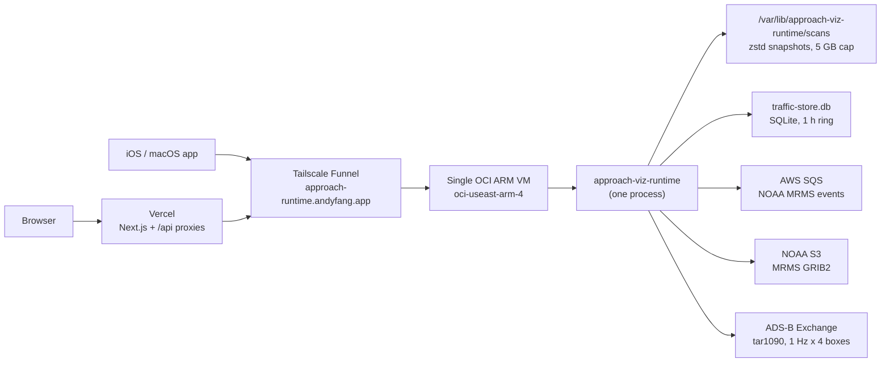
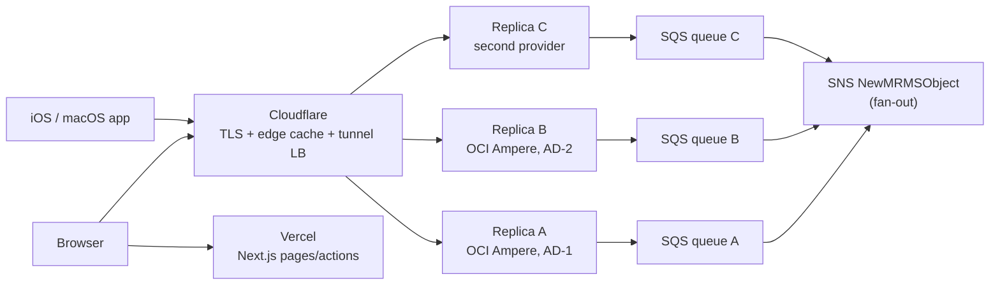

# Hosting and Availability

Proposal for removing the single points of failure in the runtime deployment without
materially increasing cost. No code changes are implied by this document alone; the
migration steps that do require code changes are marked as such.

## Current Topology

## Failure Inventory

There is more than one single point of failure in this path.

1. **The VM.** Host, availability domain, and region are all one. An OOM during MRMS
   decode, a full disk, or an AD outage takes the whole API down.
2. **Tailscale Funnel.** Beta, with non-configurable and undisclosed bandwidth limits,
   and — per Tailscale — no failover and no load balancing. It is also bound to that one
   node's tailnet identity, so it cannot front a second origin. It adds a relay hop.
3. **Node-local state.** `traffic-store.db` and the snapshot directory are on the
   instance's disk, so scaling out is not a configuration change.
4. **Singleton ingest workers.** Two nodes sharing one SQS queue become competing
   consumers: each receives a subset of `ObjectCreated` events, so _both_ end up with
   partially assembled scans. This is the one real blocker to symmetric replicas.
5. **`GET /healthz` is liveness, not readiness.** It returns `"ok"` unconditionally
   (`services/runtime-rs/src/weather/mod.rs`). A replica with no MRMS snapshot loaded
   answers health checks successfully. Adding replicas behind a load balancer without
   fixing this makes availability _worse_, not better — a cold replica serves empty
   weather, which reads to users as an outage. `GET /v1/meta` already computes the
   `ready` signal that a readiness probe needs.

Separately: OCI silently reduced the Always Free Ampere A1 allocation from 4 OCPU /
24 GB to 2 OCPU / 12 GB on 2026-06-15. The deployed host is a 4-OCPU shape, so the
current instance is exposed to that change on a free-tier tenancy.

## Why This Is Cheap To Fix

The runtime is a cache of public data, not a system of record:

- MRMS snapshots rebuild from NOAA S3 in roughly 2–5 minutes through the existing
  startup bootstrap (`enqueue_latest_from_s3`, latest 120 base-level timestamps).
- The traffic store is a 1-hour ring refilled by the 1 Hz poll loop. A cold replica has
  shorter history trails until it fills, which degrades gracefully rather than failing.

Nothing is lost when a replica dies and nothing needs to be replicated between replicas.
The correct pattern is therefore **shared-nothing symmetric replicas**: every node runs
the identical binary, ingests independently, keeps its own local state, and serves the
same API. No leader election, no consensus, no shared database, no orchestrator.

## Target Topology

### Ingress: Cloudflare Tunnel replaces Tailscale Funnel

Run `cloudflared` on each origin with the **same tunnel name**. Cloudflare round-robins
across the tunnel's replicas and drops unhealthy ones automatically, at no cost. This
removes the beta bandwidth cap, removes inbound firewall/public-IP/TLS management from
the hosts, and gives the API a real anycast edge.

Health-aware or geo-steered routing is the paid Load Balancing product (from $5/mo for
2 origins, +$5/mo per additional origin). Start with free tunnel replicas; upgrade only
if round-robin proves insufficient.

### Edge caching (largest capacity win, zero infrastructure)

`build_router` currently sets no cache headers. MRMS volume and echo-top responses only
change every ~2 minutes, so every concurrent client viewing the same airport is an
independent origin request today.

- `/v1/weather/volume`, `/v1/weather/echo-tops`:
  `public, max-age=30, s-maxage=60, stale-while-revalidate=120`
- `/v1/traffic/adsbx`: `public, max-age=1, s-maxage=2` — short, but it collapses bursts

`stale-while-revalidate` also means a brief total origin outage is invisible to clients.

### Per-replica SQS queues

`scripts/mrms/setup_sns_sqs.py` already subscribes idempotently and applies the MRMS
product filter policy. It needs a replica parameter so each replica gets its own queue
subscribed to the same SNS topic with the same filter policy — SNS fan-out instead of
competing consumers. Cost is roughly $1–3/mo per queue at SQS's $0.40/M requests.

The script's existing stale-subscription audit becomes more important with N queues, not
less: an abandoned replica queue bills one SQS request per SNS delivery forever.

### ADS-B polling stays independent per replica

The tar1090 poll is a read of an external feed and needs no coordination. Stagger the
1 Hz tick phase per replica so N replicas do not poll in lockstep, and keep the existing
fallback base URL. At 2–3 replicas this is a reasonable load to place on that feed; it is
the constraint that should cap replica count, not compute cost.

### Readiness endpoint

Add `GET /readyz`, distinct from `/healthz`, gated on the `ready` signal `/v1/meta`
already computes (latest snapshot present and within a freshness bound) plus traffic
store freshness. Point the load balancer or tunnel health check at `/readyz`. Without
this, replica rollout ships cold replicas into rotation.

## Where To Put The Replicas

| Replica | Placement                                 | Cost                          | Buys                                  |
| ------- | ----------------------------------------- | ----------------------------- | ------------------------------------- |
| A       | Existing OCI Ampere, us-ashburn-1         | $0 (Always Free)              | baseline                              |
| B       | OCI Ampere, different availability domain | $0 within the same allocation | host/AD failure                       |
| C       | Different provider entirely               | ~$8–15/mo                     | provider, region, and account failure |

Upgrade the OCI tenancy to Pay-As-You-Go. Always Free resources remain free, but the
tenancy stops being subject to idle reclamation (A1 shapes are reclaimed at <20% p95 CPU,
network, and memory over 7 days) and, as of mid-2026, PAYG tenancies appear to retain the
4 OCPU / 24 GB allocation that free tenancies lost.

Replica C is the one that actually buys independence — A and B share a provider, a region,
and an account, which is a single correlated failure domain covering suspension, regional
outage, and unilateral free-tier changes. Hetzner's ARM CAX shapes are the cheapest real
option (CAX21: 4 vCPU / 8 GB, ~€8/mo) but are EU-only, so it serves better as a failover
origin than a co-primary for US clients; a US x86 VPS in the $8–15/mo range is the
alternative. Verify current pricing before committing — Hetzner raised prices twice in 2026.

## What Not To Do

- **Hyperscaler VPC with managed NAT.** MRMS plus ADS-B ingest is roughly 1–3 TB/month
  _inbound_. AWS NAT Gateway and GCP Cloud NAT bill per GB processed (~$0.045/GB), so the
  NAT line alone is $45–135/mo before any compute. Fixed-price VPS bandwidth allowances
  and OCI's 10 TB/mo free egress are the reason this workload is cheap where it is.
- **Serverless / scale-to-zero** (Lambda, Cloud Run, Fargate). This is a stateful hot
  cache with a 2-minute ingest loop, a 1 Hz poller, and a large in-memory scan. Scale-to-zero
  destroys the property that makes queries fast. Cloud Run with `min-instances=2` and
  always-allocated CPU lands around $70–100/mo — worse on both axes.
- **Cloudflare Workers for the runtime itself.** The GRIB decode over 33 levels of the
  CONUS grid does not fit Workers' CPU model. Workers belong at the edge in front of the
  origins, not in place of them.
- **Kubernetes.** Nothing here needs an orchestrator. The systemd unit already does
  restart-always plus health-checked deploy with automatic rollback.
- **A shared Postgres/Redis for traffic history.** Replaces a free local SQLite with a
  $15–50/mo managed service _and_ adds back a shared point of failure, to store data that
  is disposable within an hour.

## Cost Delta

| Line              | Now                                        | Proposed                                                           |
| ----------------- | ------------------------------------------ | ------------------------------------------------------------------ |
| Runtime compute   | 1× OCI free                                | 2× OCI free + 1× ~$8–15/mo VPS                                     |
| Ingress + TLS     | Tailscale Funnel (free, beta, no failover) | Cloudflare Tunnel replicas (free)                                  |
| Load balancing    | none                                       | free via tunnel replicas; $5/mo if health-aware steering is wanted |
| SQS               | 1 queue                                    | N queues, +~$1–3/mo                                                |
| Egress to clients | Funnel-limited                             | Cloudflare (free egress)                                           |
| Web app           | Vercel                                     | unchanged                                                          |

Roughly **$10–20/mo** total, versus a free-but-fragile single box.

The item to check first is observability, not compute: Datadog bills per host for APM,
and the OCI host additionally runs `ddprof` continuous profiling. Going from one host to
three triples that line, which is likely a larger delta than all the infrastructure above
combined. Options are full Datadog on one designated replica with metrics-only on the
others, or moving to a free-tier alternative.

## Web Client Path

Browsers currently reach the runtime through the Vercel proxy routes while native clients
go direct. The runtime already sets `CorsLayer::allow_origin(Any)`, so the browser could
also go direct — except `next.config.ts` sets `Cross-Origin-Embedder-Policy: require-corp`,
which requires cross-origin subresources to carry
`Cross-Origin-Resource-Policy: cross-origin`.

Adding that one response header in `build_router` lets the web client bypass the Vercel
hop: one fewer dependency in the client path, less Vercel bandwidth, lower latency, and
responses served from the Cloudflare edge cache instead of re-fetched per proxy
invocation. The proxy routes should stay as a fallback and to keep the runtime URL
configurable.

## Migration Order

Each step is independently valuable and independently revertible.

1. **Response headers** (code): cache-control on the weather/traffic routes,
   `Cross-Origin-Resource-Policy: cross-origin` for direct browser access.
2. **`/readyz`** (code): readiness distinct from liveness, gated on snapshot freshness.
3. **Cloudflare Tunnel** on the existing host, replacing Tailscale Funnel. Still one
   origin — this step is about ingress and edge caching, not redundancy.
4. **Parameterize deploy** (code): generalize `scripts/runtime/deploy_oci.sh` to a
   host-agnostic `deploy_runtime.sh` carrying a replica identity, and add a replica
   parameter to `scripts/mrms/setup_sns_sqs.py`.
5. **Replica B** in a second OCI availability domain, same tunnel name. This is the step
   that actually removes the SPOF.
6. **Replica C** at a second provider, once B has proven the symmetric-replica model.
