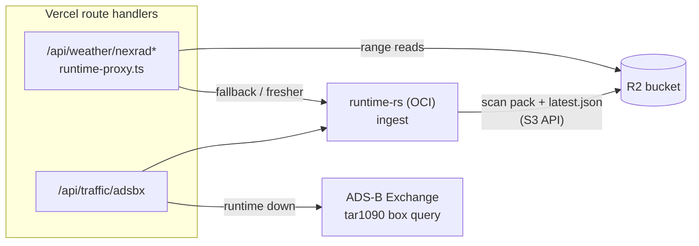

# Runtime Fallbacks (Weather Scan Packs in R2, Direct Traffic)

The runtime host (OCI) is the only process that ingests MRMS weather and ADS-B traffic. These two fallbacks keep the web app's weather and traffic working while that host is down. Both run in the existing Vercel route handlers; the only new service is an R2 bucket.

- **Weather:** after each scan, the runtime also publishes an immutable **scan pack** to Cloudflare R2. The weather route answers from the newest pack and falls back to the runtime (or the other way round when the pack is stale). A weather scan minutes old is still useful, so a stored copy is a real fallback.
- **Traffic:** stored positions go stale in seconds, so storage cannot help. When the runtime fails, the traffic route instead fetches ADS-B Exchange itself for just the requested area and returns current aircraft, without history.

Both fallbacks compute responses with the runtime's own code, compiled to WASM (`crates/approach-viz-server-wasm`, built into `packages/approach-viz-server-wasm/` and committed, since the Vercel build has no Rust toolchain). The iOS/macOS app calls the runtime directly and does not get either fallback.

## Weather

### Byte-identical responses

The volume brick merge, echo-top filtering, query windowing, parameter validation, and AVMR/AVET encoding moved from `services/runtime-rs/src/weather/{encoding,projection}.rs` into `crates/approach-viz-core/src/mrms_query/`. The runtime (reading its in-memory snapshot) and the weather route (reading a pack) both call that code, so they produce the same bytes and the same `X-AV-*` headers. The pack stores the header list the runtime computes, so the route never re-derives it.

Checked against a production scan (`20260925-034642`, 21.4M voxels):

- **Runtime refactor:** the unmodified and refactored runtimes returned identical bodies, headers, and statuses for 570 captured queries (CONUS and OCONUS origins, 4 parameter sets each, grid edges, error cases).
- **Web route over R2:** the route, reading the published pack through the real R2 client (signed S3 requests with byte ranges) against an S3-compatible server, returned bodies identical to the original runtime for all 564 canonical queries.

### Scan pack (`AVSP` v1)

`crates/approach-viz-core/src/mrms_pack.rs` owns the format. It is one object per scan, `<prefix>/scans/<timestamp>-<generated_at_ms>.avsp` (the generation time keeps two ingesters' packs for one scan from sharing a key):

- **Header:** scan metadata, grid, tile layout, level bounds, the echo-top summary, and the response headers of both endpoints. It ends with two directories: `(record_count, byte_len)` per row-major tile and per tile-row echo-top band.
- **Data:** each tile's voxels as columnar records, then each tile row's echo tops. Every chunk is an independent raw-deflate stream.

Voxels keep their snapshot order within a tile, and echo tops keep their row-major order across bands. Brick merging depends on that order, so the writer rejects out-of-order echo tops. A query reads the header once per function instance, then one contiguous range per tile row of its window. The reader validates every length and fails loudly on truncated, corrupt, or mismatched data.

For the reference scan the pack is 21.8 MB (the zstd snapshot is 58 MB), with a 50 KB header. It builds in 0.55 s at deflate level 3; level 1 gave 34.0 MB in 0.32 s and level 6 gave 19.0 MB in 1.25 s. The heaviest 220 nm window reads 13 ranges totalling 4.7 MB.

`<prefix>/latest.json` is the only mutable object: `{version, timestamp, key, headerLength, byteLength, scanTime, generatedAt, publishedAt}`.

### Runtime publisher

`services/runtime-rs/src/weather/r2_publish.rs` publishes on its own task, like persistence. The channel holds only the newest scan, and each publish runs these steps:

1. Read the manifest and its ETag. If it already names the same or a newer scan, skip. This covers a restart with an older snapshot on disk, and a second ingester.
2. Build the pack on the blocking pool.
3. PUT the pack (`immutable`).
4. PUT the manifest (`no-store`) conditionally: `If-Match` the ETag read in step 1, or `If-None-Match: *` when there was none. If another publisher wrote it in between (412/409), re-read it; stop if it names the same or a newer scan, otherwise retry (3 attempts). Concurrent publishers therefore can never move the manifest backwards.
5. List `<prefix>/scans/` and delete all but the newest 5 packs, never the pack the manifest now names.

Publishing failures are logged. The next scan retries, and serving from the runtime is unaffected.

Configure publishing with all four of `RUNTIME_R2_ENDPOINT` (`https://<account-id>.r2.cloudflarestorage.com`), `RUNTIME_R2_BUCKET`, `RUNTIME_R2_ACCESS_KEY_ID`, and `RUNTIME_R2_SECRET_ACCESS_KEY`, or with none of them. A partial set fails startup. `RUNTIME_R2_PREFIX` defaults to `mrms`.

On the OCI host these variables go in `/etc/approach-viz-runtime/r2-publish.env` (owner root, mode 0600). The deploy script's unit loads that file with `EnvironmentFile=-`, so the secret is never in the world-readable unit or the deploy environment.

### Weather route

`app/api/weather/nexrad/runtime-proxy.ts` validates the query, then tries two sources inside one 8 s deadline. The first gets a 4 s share.

- **Order:** R2 packs first while the published scan is at most 15 minutes old. Past that, publishing has stalled while the runtime may still be current, so the runtime goes first and the stale pack is the fallback.
- **Pack reads:** `scan-packs.ts` reads R2 through its S3 API with a read-only token (`aws4fetch`). Per function instance, the manifest is cached for 5 s and parsed pack headers for the 2 newest packs; a pack that disagrees with its manifest is an error. Range reads run in parallel and are concatenated in order.
- **Shared reads:** concurrent requests share the cached manifest and header reads. Those reads run on their own 8 s timeout, never one request's signal, and each request waits under its own deadline. One request giving up therefore never aborts a read another request is waiting on.
- **Pack lifetime:** evicted packs are not freed explicitly, because a request may still be building from one. wasm-bindgen's `FinalizationRegistry` releases the WASM memory once nothing references the pack.
- **Configuration:** all of `WEATHER_R2_ENDPOINT`, `WEATHER_R2_BUCKET`, `WEATHER_R2_ACCESS_KEY_ID`, and `WEATHER_R2_SECRET_ACCESS_KEY`, or none (runtime only). A partial set makes the weather routes return 500. `WEATHER_R2_PREFIX` defaults to `mrms`.
- **Caching:** successful responses carry `Vercel-CDN-Cache-Control: public, s-maxage=30`, so viewers of the same place share one build, while browsers still see `no-store`. Scans change every ~2 minutes.
- **Upstream header:** `X-AV-WEATHER-UPSTREAM: packs|runtime` records which source answered.

### Memory

WASM memory never shrinks, so the query path keeps its peak low even though Vercel functions have far more than it needs. None of these changed output bytes; the pack-equivalence check below verified each one.

- **Streaming tiles:** tiles are decoded one at a time straight into the brick collector (`VolumeCollector`), so the window's voxels are never all held at once.
- **8-byte merge cells:** the dBZ bucket is derived when needed instead of stored, and cells live in fixed 64 KB chunks with no doubling slack. Bricks are 16 bytes in the same chunks, so freed cell chunks get reused.
- **No intermediate columns:** AVMR columns are written straight from the bricks, and the finished FlatBuffer is taken without a copy.

On the heaviest window of the reference scan (220 nm, 4.85M decoded voxels, 833k bricks), WASM memory peaked at 260 MB before these changes and 72 MB after.

## Traffic

`app/api/traffic/adsbx/route.ts` still forwards to the runtime first. For binary requests (`format=binary`, what the web client sends), the runtime gets 3.5 s of the 6.5 s deadline. If it throws, times out, or returns a 5xx, the route asks ADS-B Exchange directly:

- **Request:** the same tar1090 endpoint, hosts, and browser-like headers as the runtime's poller: `/re-api/?binCraft&zstd&box=…`, for the box around the query's radius only. `ADSBX_TAR1090_BASE_URLS` (comma-separated) overrides the hosts; the default is `globe.adsbexchange.com`, then `globe.theairtraffic.com`.
- **Size limits:** the upstream body is capped at 4 MiB and its decompressed snapshot at 32 MiB (a 220 nm box is well under 1 MB). An oversized response fails the fallback instead of being decoded.
- **Decoding and selection:** Node decompresses the zstd body. `crates/approach-viz-core/src/traffic_query.rs` decodes binCraft, parses the query, and selects current aircraft, the same functions the runtime uses. The selection matches what the runtime's store reports after ingesting only that one poll: stale reports (over 60 s) and optionally ground traffic dropped, ages measured from the poll, freshest first, radius and limit applied. A runtime test (`direct_fallback_matches_a_store_holding_one_poll`) checks this against the real store.
- **Response:** an AVTR v4 payload with no history, `X-AV-TRAFFIC-UPSTREAM: direct`, and the snapshot headers set to fresh. The web client keeps building trails from its own polls; only the history backfill is missing until the runtime returns.
- **JSON requests** have no fallback and keep the existing error payload. If both the runtime and the direct fetch fail, the route returns that error payload naming both failures.

Moving the traffic code into core changed no runtime behavior. The `traffic_store` bench fingerprints (`c70abf74df697497`, live and reloaded) and the decode/encode fingerprints of a real 512-aircraft binCraft snapshot were identical before and after.

**Risk:** ADS-B Exchange's `re-api` is not an official API, and during a runtime outage every open web viewer calls it every 5 s. On Sep 25 2026 a throwaway preview deployment in Vercel's iad1 region, with the runtime made unreachable, returned about 250 aircraft per airport in 92–253 ms. Both tar1090 hosts answered directly from iad1, and a burst of 40 fallback requests all succeeded. Access and rate limits can still change, so check the route's `X-AV-TRAFFIC-UPSTREAM` header during a real outage.

## Setup

1. **R2 bucket:** create `approach-viz-weather`. Add a lifecycle rule deleting `mrms/scans/` objects after 1 day as a backstop for packs orphaned by a publisher that stopped mid-prune.
2. **R2 API tokens:** one with Object Read & Write for the runtime, and a separate Object Read-only token for Vercel.
3. **Runtime:** on the host, write the four `RUNTIME_R2_*` variables to `/etc/approach-viz-runtime/r2-publish.env` (root, 0600), then redeploy or `sudo systemctl restart approach-viz-runtime`. Watch the journal for `Published MRMS scan`.
4. **Vercel:** set the four `WEATHER_R2_*` variables with the read-only token and redeploy.

To check the fallbacks after deploying, stop the runtime briefly: weather responses should carry `X-AV-WEATHER-UPSTREAM: packs` and binary traffic responses `X-AV-TRAFFIC-UPSTREAM: direct`.

## Cost

These figures use measured sizes and published Vercel/Cloudflare prices (iad1); check current pricing.

- **Vercel invocations:** none added; both routes were already invoked per request.
- **Vercel CPU:** pack builds use Active CPU, $0.128 per CPU-hour, billed only while code runs. On heavy 220 nm windows a build averaged ~40–50 ms, so 1M uncached builds is about $1.60–1.80. The CDN cache removes repeat builds for the same place.
- **Vercel memory:** roughly unchanged; functions previously held memory while waiting on the runtime and now wait on R2 instead.
- **R2 storage:** 5 packs × 22 MB ≈ 110 MB, inside the 10 GB free tier.
- **R2 writes:** 3 Class A operations per scan (pack, manifest, list), about 65k a month against 1M free. Deletes are free.
- **R2 reads:** the manifest once per 5 s per function instance, the header once per pack per instance, and up to one read per tile row per uncached volume request (echo tops: one). The first 10M a month are free. R2 has no egress fees.
- **Upload from OCI:** 22 MB × 720 scans/day ≈ 0.5 TB/month, inside OCI's 10 TB/month of free egress.
- **Traffic fallback:** a few ms of CPU per request, and only during runtime outages.

## Validation

- **Pack equivalence (native):** `cargo run --release -p approach-viz-runtime --example scan_pack -- <snapshot.avsn.zst> [out.avsp]` builds a pack from a stored snapshot. It checks 2,040 volume and echo-top queries across CONUS/OCONUS against the snapshot path byte for byte, and reports the heaviest window and the peak heap of one pack query.
- **Unit tests:** `cargo test -p approach-viz-core` covers pack round-trips, corruption and ordering, traffic query parsing, binCraft decoding, and direct selection. The runtime test `direct_fallback_matches_a_store_holding_one_poll` compares the fallback's selection with the real traffic store.
- **Route tests:** `npm run test:routes` serves `fixtures/server-wasm/` through both routes: the sample scan pack against in-memory payloads, and a synthetic binCraft snapshot against the expected AVTR. `weather_route_fixture_is_current` and `traffic_route_fixture_is_current` keep the fixtures in sync; regenerate with `UPDATE_SERVER_FIXTURES=1 cargo test -p approach-viz-core fixture_is_current`.
- **After changing `mrms_query`, `mrms_pack`, `traffic_query`, or `crates/approach-viz-server-wasm`:** rebuild the committed WASM with `npm run build:wasm:server`.
