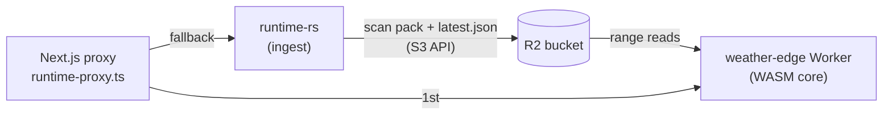

# Weather Edge (R2 + Cloudflare Worker)

The weather endpoints no longer depend on the runtime host being up. The runtime still ingests MRMS, but after each scan it publishes an immutable **scan pack** to Cloudflare R2. A Cloudflare Worker (`services/weather-edge`) answers `/v1/weather/volume` and `/v1/weather/echo-tops` from those packs. The web proxy tries the Worker first and falls back to the runtime.

If the runtime host dies, the Worker keeps serving the last published scan (stale, with its scan-time headers intact) instead of failing. If the Worker or R2 fails, the proxy falls back to the runtime as before.

## Byte-identical responses

The volume brick merge, echo-top filtering, query windowing, parameter validation, and AVMR/AVET encoding moved from `services/runtime-rs/src/weather/{encoding,projection}.rs` into `crates/approach-viz-core/src/mrms_query/`. The runtime (reading its in-memory snapshot) and the Worker (reading a pack, via `crates/approach-viz-weather-edge`) both call that code, so they produce the same bytes and the same `X-AV-*` headers. The pack stores the header list the runtime computes, so the Worker never re-derives it.

The move changed no output. The unmodified runtime and the refactored runtime returned identical bodies, headers, and statuses for 570 queries against a production scan (`20260925-034642`, 21.4M voxels): 4 parameter sets per origin, CONUS and OCONUS origins, grid edges, and error cases. The Worker running in `wrangler dev` over the same scan's pack matched on 568 of 570. The other 2 are malformed-parameter requests, where the Worker's 400 message text differs from axum's deserializer text. The web proxy validates parameters first, so it never sends those.

## Scan pack (`AVSP` v1)

`crates/approach-viz-core/src/mrms_pack.rs` owns the format. It is one object per scan, `<prefix>/scans/<timestamp>.avsp`:

- **Header:** scan metadata, grid, tile layout, level bounds, the echo-top summary, and the response headers of both endpoints. It ends with two directories: `(record_count, byte_len)` per row-major tile and per tile-row echo-top band.
- **Data:** each tile's voxels as columnar records, then each tile row's echo tops. Every chunk is an independent raw-deflate stream.

Voxels keep their snapshot order within a tile, and echo tops keep their row-major order across bands. Brick merging depends on that order, so the writer rejects out-of-order echo tops. A query reads the header once per isolate, then one contiguous range per tile row of its window. The reader validates every length and fails loudly on truncated, corrupt, or mismatched data.

For the reference scan the pack is 21.8 MB (the zstd snapshot is 58 MB), with a 50 KB header. It builds in 0.55 s at deflate level 3; level 1 gave 34.0 MB in 0.32 s and level 6 gave 19.0 MB in 1.25 s. The heaviest 220 nm window reads 13 ranges totalling 4.7 MB.

`<prefix>/latest.json` is the only mutable object: `{version, timestamp, key, headerLength, byteLength, scanTime, generatedAt, publishedAt}`.

## Runtime publisher

`services/runtime-rs/src/weather/edge_publish.rs` publishes on its own task, like persistence. The channel holds only the newest scan, and each publish runs these steps:

1. Read the manifest. If it already names the same or a newer scan, skip. This covers a restart with an older snapshot on disk, and a second ingester.
2. Build the pack on the blocking pool.
3. PUT the pack (`immutable`), then PUT the manifest (`no-store`).
4. List `<prefix>/scans/` and delete all but the newest 5 packs.

Publishing failures are logged. The next scan retries, and serving from the runtime is unaffected.

Configure publishing with all four of `RUNTIME_R2_ENDPOINT` (`https://<account-id>.r2.cloudflarestorage.com`), `RUNTIME_R2_BUCKET`, `RUNTIME_R2_ACCESS_KEY_ID`, and `RUNTIME_R2_SECRET_ACCESS_KEY`, or with none of them. A partial set fails startup. `RUNTIME_R2_PREFIX` defaults to `mrms`.

On the OCI host these variables go in `/etc/approach-viz-runtime/edge-publish.env` (owner root, mode 0600). The deploy script's unit loads that file with `EnvironmentFile=-`, so the secret is never in the world-readable unit or the deploy environment.

## Worker

`services/weather-edge/src/weather.ts` handles I/O. The WASM crate decides every byte.

- **Validation first:** parameters are validated in WASM with the runtime's rules. Invalid ones get a 400 before any R2 read.
- **Caching:** the manifest is cached per isolate for 5 s. The parsed pack header is cached per isolate for the 2 newest packs, and a pack that disagrees with its manifest is a 500.
- **Chunk assembly:** range reads run in parallel. Each chunk is appended into WASM memory in order and released, so JS never holds a concatenated copy.
- **Gzip in WASM:** payloads are gzipped inside WASM at level 1. On the 15 MB heaviest payload that took 63 ms, versus 366 ms for the level-6 `CompressionStream`, for about 15% more bytes. The uncompressed payload never enters the JS heap.
  - Responses are sent with `encodeBody: "manual"`. The client's real `Accept-Encoding` comes from `request.cf.clientAcceptEncoding`, because Workers see a rewritten header. Non-gzip clients get a decompressed stream.
- **Edge cache:** the Cache API holds gzipped payloads keyed by pack key plus normalized query. Packs are immutable, so an entry can never go stale.
- **Errors and health:** no manifest is a 503. `/healthz` returns 503 once the published scan is more than 15 minutes old, so point uptime monitoring at it to catch a stalled ingester or publisher.

### Memory budget

A Worker isolate gets 128 MB for JS and WASM together, and WASM memory never shrinks. Four changes keep the query path within that. None changed output bytes; the pack-equivalence check below verified each one.

- **Streaming tiles:** tiles are decoded one at a time straight into the brick collector (`VolumeCollector`), so the window's voxels are never all held at once.
- **8-byte merge cells:** the dBZ bucket is derived when needed instead of stored, and cells live in fixed 64 KB chunks with no doubling slack. Bricks are 16 bytes in the same chunks, so freed cell chunks get reused.
- **No intermediate columns:** AVMR columns are written straight from the bricks, and the finished FlatBuffer is taken without a copy.
- **Early free:** the fetched pack bytes are freed before merging.

On the heaviest window of the reference scan (220 nm, 4.85M decoded voxels, 833k bricks), WASM memory peaked at 260 MB before these changes and 72 MB after. After 406 consecutive heavy queries in one instance it reached 79 MB. Windows over 6M decoded voxels (≈90 MB of WASM) are refused with a 503 before any data is fetched, and the proxy then asks the runtime.

## Web proxy

`app/api/weather/nexrad/runtime-proxy.ts` works through `weatherUpstreams()` in order:

- **Edge first:** when `WEATHER_EDGE_BASE_URL` is set, the Worker is tried first with a 4 s share of the 8 s deadline.
- **Runtime fallback:** any failure (non-2xx including the over-budget 503, network error, or timeout) goes to the runtime (`RUNTIME_UPSTREAM_BASE_URL`) with the same query.
- **Upstream header:** `X-AV-WEATHER-UPSTREAM: edge|runtime` records which upstream answered.

Unset `WEATHER_EDGE_BASE_URL` to go back to runtime-only.

## Setup

1. **R2 bucket:** create `approach-viz-weather` (the name is in `wrangler.jsonc`). Add a lifecycle rule deleting `mrms/scans/` objects after 1 day as a backstop for packs orphaned by a publisher that stopped mid-prune.
2. **R2 API token:** create one with Object Read & Write on that bucket.
3. **Host env file:** on the runtime host, write the four `RUNTIME_R2_*` variables to `/etc/approach-viz-runtime/edge-publish.env` (root, 0600), then redeploy or `sudo systemctl restart approach-viz-runtime`. Watch the journal for `Published MRMS scan`.
4. **Worker:** in `services/weather-edge`, run `npm install`, then `npm run deploy`. That builds the WASM with `wasm-pack` and runs `wrangler deploy`. Route the Worker to a custom domain: the Cache API is a no-op on `*.workers.dev`.
5. **Vercel:** set `WEATHER_EDGE_BASE_URL` to the Worker's URL.

## Cost

These figures use measured sizes and Cloudflare's published prices; check current pricing.

- **R2 storage:** 5 packs × 22 MB ≈ 110 MB, inside the 10 GB free tier.
- **R2 writes:** 3 Class A operations per scan (pack, manifest, list), about 65k a month against 1M free. Deletes are free.
- **R2 reads:** Class B reads are the manifest once per 5 s per isolate, the header once per pack per isolate, and at most one read per tile row per uncached volume query. The first 10M a month are free. Egress is free.
- **Workers:** the paid plan ($5/mo) is required, because heavy queries use 50–430 ms of CPU against the free plan's 10 ms. On 406 heavy 220 nm windows, the Node/V8 build-plus-gzip time averaged 52 ms. The 30M included CPU-ms therefore cover roughly 500k uncached heavy queries a month; typical windows are much cheaper.
- **Upload from OCI:** 22 MB × 720 scans/day ≈ 0.5 TB/month, inside OCI's 10 TB/month of free egress.

## Validation

- **Pack equivalence (native):** `cargo run --release -p approach-viz-runtime --example scan_pack -- <snapshot.avsn.zst> [out.avsp]` builds a pack from a stored snapshot. It checks 2,040 volume and echo-top queries across CONUS/OCONUS against the snapshot path byte for byte, and reports the heaviest window and the peak heap of one pack query.
- **Unit tests:** `cargo test -p approach-viz-core` covers pack round-trips, corruption, and ordering. `edge_worker_fixture_is_current` keeps `services/weather-edge/test/fixtures` in sync; regenerate with `UPDATE_EDGE_FIXTURES=1`.
- **Worker tests:** in `services/weather-edge`, `npm run build:wasm && npm run typecheck && npm test` serves the fixture pack through the handler and compares against in-memory payloads. CI runs this in the `weather-edge` job.
- **End to end:**
  1. Serve a snapshot from the runtime with the network ingest disabled (`RUNTIME_MRMS_LOCAL_DATA_DIR=<empty dir>`, `RUNTIME_MRMS_LOCAL_DATA_OFFLINE=true`), pointing `RUNTIME_R2_*` at any S3-compatible server.
  2. Copy the published pack and manifest into local R2 with `npx wrangler r2 object put approach-viz-weather/<key> --file <file> --local`.
  3. Run `npx wrangler dev` and compare its responses to the runtime's.
